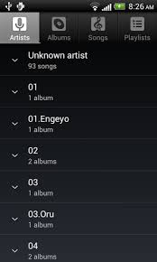
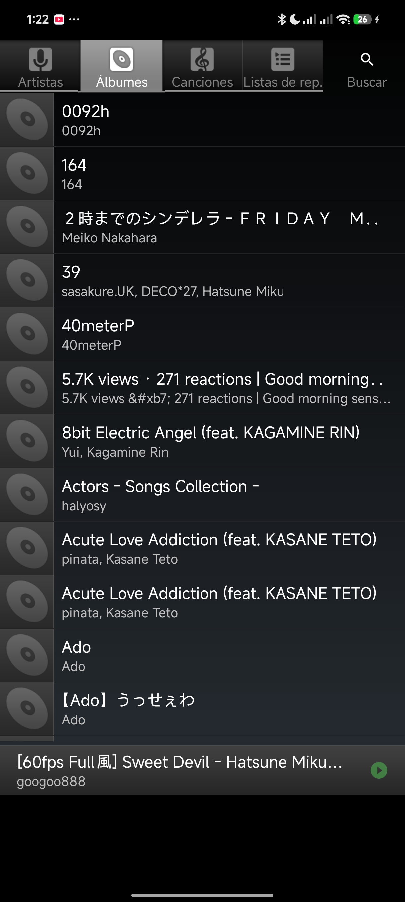
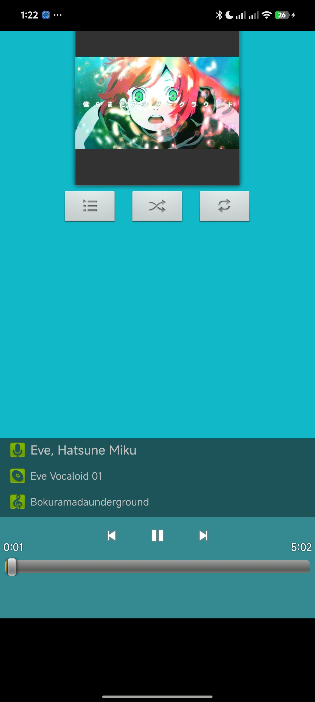
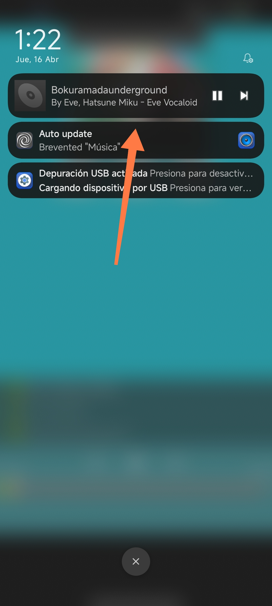

# 🎧 Retro Music Player – Android 14 Port
## english read to README-ENG.md please!!

Este repositorio contiene un parche de compatibilidad para un reproductor de música clásico de android 4.4.2 con estética tipo Android KitKat (Holo UI).
El objetivo fue rehabilitar la aplicación para que funcione correctamente en hardware moderno y en Android 14 (incluyendo HyperOS), superando restricciones de seguridad y cambios en APIs internas del sistema.

---
## 📸 Before / After

<p align="center">
  
  
</p>

---

## 📱 Screenshots

<p align="center">
  
  
  
</p>


## 🚀 Desafíos Técnicos y Soluciones

El proceso implicó ingeniería inversa directa sobre código Smali y modificaciones en el AndroidManifest.

---

### 1. 🔐 Seguridad y SharedPreferences

**Problema:**
La aplicación utilizaba el flag `MODE_WORLD_READABLE (0x1)` al acceder a preferencias, lo cual provoca una `SecurityException` en versiones modernas de Android.

**Solución:**
Se modificó `MediaPlaybackService.smali` para reemplazar el modo de acceso por:

```
MODE_PRIVATE (0x0)
```

---

### 2. 🗄️ Incompatibilidad en consultas SQL

**Problema:**
Error en runtime:

```
IllegalArgumentException: Invalid column audio._id
```

Esto ocurre porque los `ContentProviders` modernos ya no aceptan prefijos de tabla (`audio.`) en las consultas.

**Solución:**
Se parcheó la cadena en `MediaPlaybackService.smali` (aprox. línea 242):

```
audio._id AS _id  →  _id
```

---

### 3. ⚙️ Restricciones de instalación (target SDK)

**Problema:**
Android 14 bloquea por defecto apps con `targetSdkVersion < 23`.

**Solución:**

* Se ajustó `targetSdkVersion` a **24**
* Se añadieron permisos modernos:

  * `READ_MEDIA_AUDIO`
  * `POST_NOTIFICATIONS`

Esto permite mantener funcionalidad en segundo plano sin romper compatibilidad.

---

## 🛠️ Herramientas Utilizadas

* **Apktool** → Decompilación y recompilación de la APK
* **uber-apk-signer** → Firma y alineación (zipalign)
* **ADB** → Instalación con bypass de restricciones:

```
adb install --bypass-low-target-sdk-block app.apk
```

---

## 📱 Notas de Rendimiento (HyperOS / Xiaomi)

Para asegurar reproducción estable:

* Desactivar restricciones de batería
* Permitir ejecución en segundo plano
* Evitar optimizaciones agresivas del sistema

---

## 🎯 Objetivo del Proyecto

Preservar aplicaciones clásicas de Android manteniendo:

* Su estética original (Holo UI)
* Su comportamiento base
* Compatibilidad con sistemas modernos

---

## ⚠️ Nota

Este proyecto es experimental y enfocado a aprendizaje de ingeniería inversa y compatibilidad.
Algunas funciones pueden variar dependiendo del dispositivo o capa de personalización.

---

## 😈 Bonus

Este proyecto forma parte de un enfoque más amplio de:

* Rehabilitación de software legacy
* Ingeniería inversa en Android
* Optimización de apps clásicas en sistemas modernos

---
